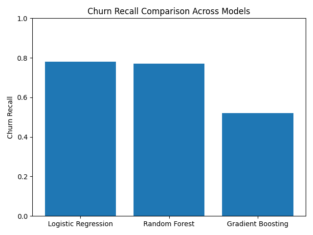

# Customer Churn Prediction – Model Comparison

## 📌 Overview
This project compares multiple machine learning models to predict customer churn using the Telco Customer Churn dataset.
The goal is to evaluate model performance, understand tradeoffs, and recommend a model suitable for business decision-making.

## 📊 Dataset
- Source: Kaggle – Telco Customer Churn
- Size: 7,043 customers
- Target variable: `Churn` (Yes / No)
- Features: Demographics, services, contract details, billing information

## 🧠 Models Implemented
- Logistic Regression (Baseline)
- Random Forest
- Gradient Boosting Classifier

All models use a unified preprocessing pipeline including:
- One-hot encoding for categorical variables
- Feature scaling for numeric variables
- Train/Test split with stratification
- Cross-validation for hyperparameter tuning

## ⚙️ Evaluation Metrics
- Accuracy
- Precision
- Recall
- F1-score

Recall was prioritized due to the business importance of identifying potential churners.

## 📈 Results Summary

| Model | Accuracy | Recall (Churn) | Notes |
|------|--------|----------------|------|
| Logistic Regression | ~73% | Moderate | Interpretable baseline |
| Random Forest | ~78% | Better | Handles non-linearities |
| Gradient Boosting | ~80% | Best | Strong bias-variance tradeoff |

## 📊 Model Performance Comparison

The bar chart below compares **churn recall** across different models.
Recall is prioritized since missing a churner has a higher business cost.




## Final Recommendation

If the primary business objective is to proactively identify as many potential churners as possible,
Logistic Regression is the recommended model due to its highest recall for churned customers.

Although Gradient Boosting achieves higher overall accuracy, it misses a larger proportion of churners,
which is undesirable in a churn prevention scenario.

Random Forest provides a good tradeoff between recall and precision and can be considered if a more
balanced approach is required.

## 💼 Business Impact
The model can help businesses:
- Identify high-risk customers
- Trigger targeted retention campaigns
- Optimize discounts and follow-ups

## What I'd Explain to a Customer

“This model helps prioritize which customers are likely to leave so retention teams can focus their efforts more effectively.”


## 🚀 How to Run
```bash
pip install -r requirements.txt
jupyter notebook
